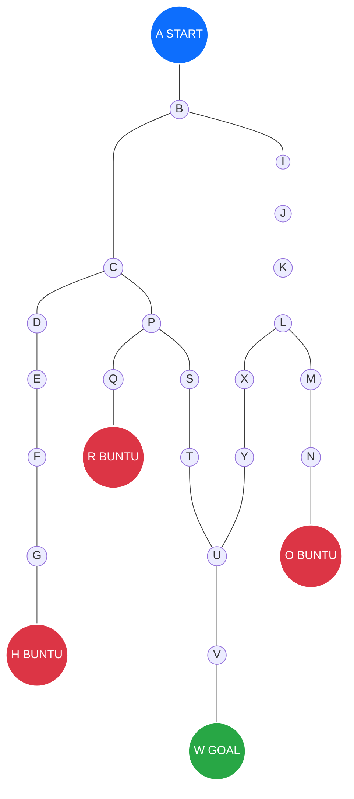
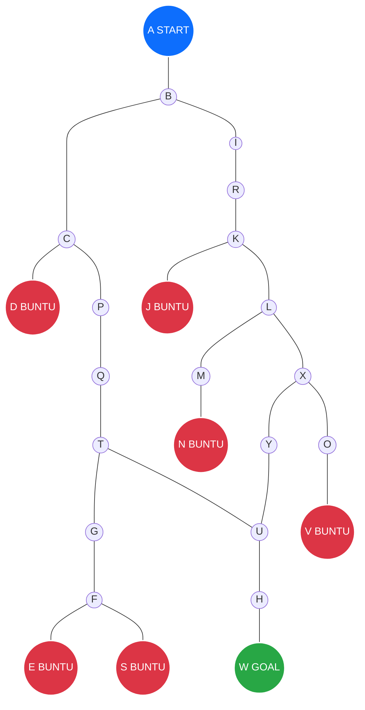
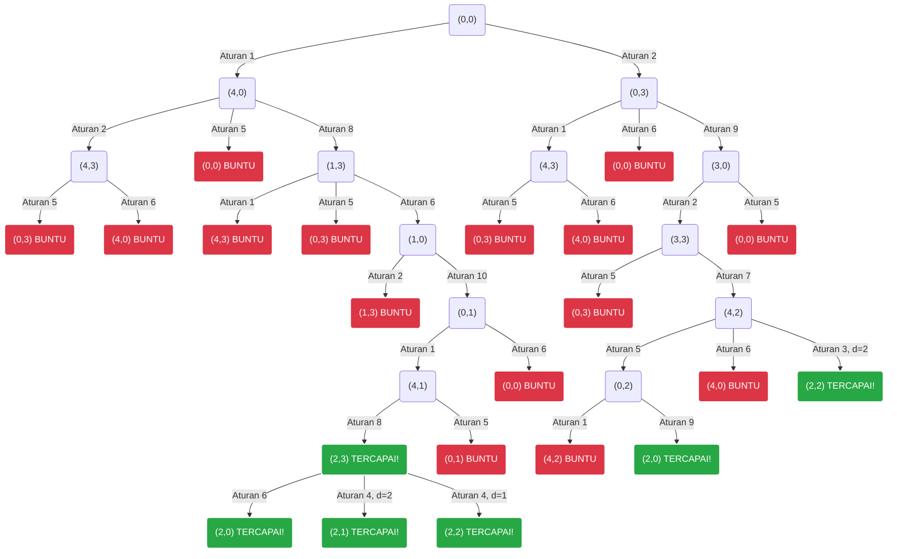

# Kumpulan Penyelesaian Tugas Kecerdasan Buatan oleh Athaya Nabil Putra Halby (2407134906) -- TI UNRI

## Daftar Isi
- [Tugas 3: Metode Pencarian](#tugas-3-metode-pencarian)
- [Tugas 2: Kasus Water Jug](#tugas-2-kasus-water-jug)
- [Tugas 1: Artikel Penerapan Kecerdasan Buatan dalam Dunia Nyata](#tugas-1-artikel-penerapan-kecerdasan-buatan-dalam-dunia-nyata)

---

## Tugas 3: Metode Pencarian

### 1. Jawaban Soal Pertama (Contoh)

**A. Representasi Graf**
Berdasarkan gambar *maze* pada bagian contoh, jalur yang dapat dilalui direpresentasikan sebagai sebuah graf. Garis pembatas (tembok) diabaikan, dan titik percabangan dipetakan sebagai *node*. Node dengan warna merah menunjukkan bahwa jalur tersebut merupakan jalan buntu.

**B. Pencarian Jalur Terpendek (BFS vs DFS)**
Untuk menentukan rute terpendek dari node A ke W, kita membandingkan metode *Breadth-First Search* (BFS) dan *Depth-First Search* (DFS). Apabila terdapat persimpangan, node akan dievaluasi berdasarkan urutan alfabet (misalnya, cabang C diprioritaskan sebelum cabang I).

**1. Breadth-First Search (BFS)**
Metode BFS melakukan pencarian secara melebar pada setiap level graf. Pendekatan ini menjamin ditemukannya rute dengan jumlah langkah paling sedikit.
* **Proses penelusuran per level:**
  * Level 0: A
  * Level 1: B
  * Level 2: C, I
  * Level 3: D, P, J
  * Level 4: E, Q, S, K
  * Level 5: F, R (buntu), T, L
  * Level 6: G, U, M, X
  * Level 7: H (buntu), V, N, Y
  * Level 8: W (ditemukan via V), O (buntu)

* **Jalur BFS:** **A - B - C - P - S - T - U - V - W** (8 langkah)

**2. Depth-First Search (DFS)**
Metode DFS menelusuri satu cabang jalur sedalam mungkin. Apabila mencapai jalan buntu, proses akan melakukan runut balik (*backtracking*) ke persimpangan sebelumnya untuk mencoba jalur alternatif.
* **Proses penelusuran:**
  * Dimulai dari A menuju B.
  * Pada persimpangan B (cabang C dan I), dipilih C berdasarkan urutan alfabet.
  * Pada persimpangan C (cabang D dan P), dipilih D.
  * Jalur ditelusuri lurus dari D menuju E, F, G, dan berakhir buntu di H. Proses melakukan *backtrack* ke C.
  * Dari C, pencarian dilanjutkan ke cabang P. Terdapat cabang Q dan S, sehingga Q dipilih.
  * Cabang Q berakhir buntu di R. Proses kembali melakukan *backtrack* ke P.
  * Dari P, pencarian dilanjutkan ke S, lalu lurus menuju T dan U.
  * Pada persimpangan U (cabang V dan Y), dipilih V yang langsung mengarah ke W.

* **Jalur DFS:** **A - B - C - P - S - T - U - V - W**

**Kesimpulan**
Kedua algoritma menghasilkan rute akhir yang sama. Namun, BFS lebih efisien dalam menemukan rute terpendek pada topologi *maze* ini. Sebaliknya, DFS harus melalui proses *backtracking* di dua jalan buntu (node H dan R) karena mengikuti aturan prioritas alfabet sebelum akhirnya menemukan jalur yang tepat.

### 2. Jawaban Soal Kedua (Latihan)

**A. Representasi Graf**
Berdasarkan topologi pada gambar *maze* kedua, jalur yang dapat dilalui direpresentasikan kembali sebagai graf. Titik percabangan dipetakan sebagai *node*, sedangkan node yang ditandai dengan warna merah menunjukkan jalan buntu (*dead end*).

**B. Pencarian Jalur Terpendek (BFS vs DFS)**
Sama seperti kasus sebelumnya, pencarian rute terpendek dari A menuju W dilakukan dengan metode BFS dan DFS. Jika terdapat percabangan, algoritma akan memprioritaskan penelusuran berdasarkan urutan alfabet (misalnya memprioritaskan C dibandingkan I).

**1. Breadth-First Search (BFS)**
BFS melakukan pencarian jalur secara melebar untuk memastikan penemuan rute dengan jumlah langkah paling minimum.
* **Proses penelusuran per level:**
  * Level 0: A
  * Level 1: B
  * Level 2: C, I
  * Level 3: D (buntu), P, R
  * Level 4: Q, K
  * Level 5: T, J (buntu), L
  * Level 6: G, U, M, X
  * Level 7: F, H, Y, N (buntu), O
  * Level 8: E (buntu), S (buntu), **W (ditemukan via H)**, V (buntu)

* **Jalur BFS:** **A - B - C - P - Q - T - U - H - W** (8 langkah)

**2. Depth-First Search (DFS)**
DFS menelusuri satu cabang jalur sedalam mungkin dan akan melakukan runut balik (*backtracking*) apabila menemui titik buntu.
* **Proses penelusuran (dengan prioritas alfabet):**
  * Dimulai dari A menuju B.
  * Pada persimpangan B (cabang C dan I), dipilih C.
  * Pada persimpangan C (cabang D dan P), dipilih D yang ternyata buntu. Proses *backtrack* kembali ke C.
  * Dari C masuk ke cabang P, lalu diteruskan ke Q dan T.
  * Pada persimpangan T (cabang G dan U), dipilih G.
  * Dari G menuju F. Pada persimpangan F (cabang E dan S), dipilih E yang ternyata buntu. Proses *backtrack* ke F, lalu memilih S yang juga buntu.
  * Sistem melakukan *backtrack* dari F kembali ke G, lalu ke T.
  * Dari T, pencarian dilanjutkan ke cabang U. 
  * Pada persimpangan U (cabang H dan Y), dipilih H yang langsung mengarah lurus ke W.

* **Jalur DFS:** **A - B - C - P - Q - T - U - H - W**

**Kesimpulan**
Pada topologi labirin kedua ini, metode BFS dan DFS kembali menghasilkan rute final yang sama. Namun, kelemahan DFS terlihat lebih jelas karena kepatuhannya pada prioritas alfabet memaksa algoritma ini tersesat dan harus melakukan *backtracking* di tiga jalan buntu berbeda (node D, E, dan S) sebelum akhirnya menemukan jalur yang benar. Sebaliknya, BFS beroperasi dengan jauh lebih stabil dan langsung memetakan rute optimal.

## Tugas 2: Kasus Water Jug

### Pendahuluan dan Aturan Permainan
Dalam permasalahan penakaran air ini, kita menggunakan dua buah takaran, yaitu Galon A yang berkapasitas maksimal 4 liter, dan Galon B yang berkapasitas maksimal 3 liter. Tujuan dari penyelesaian ruang masalah ini adalah bagaimana mendapatkan tepat 2 liter air pada Galon A, dengan bermodalkan kedua galon tersebut.

Untuk melakukan perpindahan keadaan atau ruang masalah (*State Space*), terdapat 11 aturan operasi yang dapat diterapkan:
1. Jika $x < 4$, isi galon A sampai penuh `(4,y)`.
2. Jika $y < 3$, isi galon B sampai penuh `(x,3)`.
3. Jika $x > 0$, buang sebagian air (d) dari galon A `(x-d,y)`.
4. Jika $y > 0$, buang sebagian air (d) dari galon B `(x,y-d)`.
5. Jika $x > 0$, kosongkan galon A `(0,y)`.
6. Jika $y > 0$, kosongkan galon B `(x,0)`.
7. Jika $x+y \ge 4$ dan $y > 0$, tuangkan air dari galon B ke galon A sampai galon A penuh `(4,y-(4-x))`.
8. Jika $x+y \ge 3$ dan $x > 0$, tuangkan air dari galon A ke galon B sampai galon B penuh `(x-(3-y),3)`.
9. Jika $x+y \le 4$ dan $y > 0$, tuangkan seluruh air dari galon B ke galon A `(x+y,0)`.
10. Jika $x+y \le 3$ dan $x > 0$, tuangkan seluruh air dari galon A ke galon B `(0,x+y)`.
11. Dari keadaan (0,2), tuangkan 2 liter air dari galon B ke galon A `(2,0)`.

### Jawaban No. 1: Pohon Pelacakan
Diagram pohon di bawah ini memetakan langkah-langkah penyelesaian dari keadaan awal `(0,0)` hingga mencapai kemungkinan himpunan tujuan `{(2,0), (2,1), (2,2), (2,3)}`.

### Jawaban No. 2: Tabel Solusi
Berikut adalah rincian langkah yang berurutan untuk mencapai tiga spesifik keadaan tujuan `{(2,0), (2,1), (2,2)}`.

#### Solusi untuk Tujuan: (2,0)

| Isi ember A | Isi ember B | Aturan yg dipakai |
| :---: | :---: | :--- |
| 0 | 0 | 2 (Isi galon B sampai penuh) |
| 0 | 3 | 9 (Tuang seluruh air galon B ke A) |
| 3 | 0 | 2 (Isi galon B sampai penuh) |
| 3 | 3 | 7 (Tuang air galon B ke A sampai A penuh) |
| 4 | 2 | 5 (Kosongkan galon A) |
| 0 | 2 | 9 (Tuang seluruh air galon B ke A) |
| **2** | **0** | **Solusi Tercapai** |

#### Solusi untuk Tujuan: (2,1)

| Isi ember A | Isi ember B | Aturan yg dipakai |
| :---: | :---: | :--- |
| 0 | 0 | 1 (Isi galon A sampai penuh) |
| 4 | 0 | 8 (Tuang air galon A ke B sampai B penuh) |
| 1 | 3 | 6 (Kosongkan galon B) |
| 1 | 0 | 10 (Tuang seluruh air galon A ke B) |
| 0 | 1 | 1 (Isi galon A sampai penuh) |
| 4 | 1 | 8 (Tuang air galon A ke B sampai B penuh) |
| 2 | 3 | 4 (Buang sebagian air, d=2, dari galon B) |
| **2** | **1** | **Solusi Tercapai** |

#### Solusi untuk Tujuan: (2,2)

| Isi ember A | Isi ember B | Aturan yg dipakai |
| :---: | :---: | :--- |
| 0 | 0 | 2 (Isi galon B sampai penuh) |
| 0 | 3 | 9 (Tuang seluruh air galon B ke A) |
| 3 | 0 | 2 (Isi galon B sampai penuh) |
| 3 | 3 | 7 (Tuang air galon B ke A sampai A penuh) |
| 4 | 2 | 3 (Buang sebagian air, d=2, dari galon A) |
| **2** | **2** | **Solusi Tercapai** |

---

## Tugas 1: Artikel Penerapan Kecerdasan Buatan dalam Dunia Nyata

### Mengenal Peran AI dalam Mendeteksi Serangan Cybersecurity
oleh: Athaya Nabil Putra Halby - 2407134906

#### Latar Belakang

Kalau kita perhatikan, perkembangan dunia digital belakangan ini berlari sangat cepat. Bersamaan dengan itu, ancaman keamanan siber (*cybersecurity*) juga ikut berevolusi menjadi jauh lebih kompleks. Dulu, tim IT mungkin masih sanggup mengandalkan perlindungan standar seperti *firewall* atau antivirus konvensional untuk menjaga sebuah sistem. Mereka memonitor lalu lintas jaringan secara manual dan memeriksa *log* harian. Sayangnya, cara manual seperti ini sudah tidak lagi relevan. Peretas masa kini sudah menggunakan metode otomatis yang masif dan tersebar. Jika sebuah perusahaan hanya mengandalkan tenaga manusia untuk memeriksa ribuan atau bahkan jutaan baris lalu lintas data setiap harinya, sistem mereka pasti akan kewalahan dan akhirnya jebol. Di sinilah pendekatan keamanan jaringan membutuhkan cara pandang yang baru.

#### Contoh Penerapan AI dalam Keamanan Siber

Untuk mengatasi keterbatasan sistem tradisional dan tenaga manusia, Kecerdasan Buatan (AI) masuk untuk mengambil alih tugas-tugas komputasi berat. AI mengubah cara kita bertahan, dari yang awalnya hanya pasrah menunggu diserang (pendekatan reaktif) menjadi lebih waspada dan bersiap sebelum serangan terjadi (pendekatan proaktif).

Berikut adalah beberapa contoh nyata bagaimana AI diterapkan dalam mengamankan ekosistem digital kita:

**1. Sistem Deteksi Intrusi (IDS) yang Proaktif**  
Sistem keamanan lama umumnya bekerja dengan cara mencocokkan "tanda tangan" (*signature*) virus. Kelemahannya, kalau ada virus varian baru yang belum ada di pangkalan data, sistem akan dengan mudah kebobolan. AI menyelesaikan masalah ini dengan cara mempelajari "perilaku normal" dari sebuah jaringan. Bayangkan AI ini seperti satpam yang sangat hafal dengan kebiasaan karyawan di sebuah gedung. Kalau tiba-tiba ada lalu lintas data yang mencurigakan—misalnya ada aktivitas pengunduhan data berskala besar di jam 3 pagi dari lokasi yang tidak biasa—AI akan langsung menganggap hal tersebut sebagai anomali dan membunyikan peringatan sebelum sistem utama berhasil ditembus.

**2. Analisis Malware Lanjutan (Ancaman *Zero-Day*)**  
Saat ini, pembuat virus sangat pintar merancang *malware* yang bisa bermutasi atau mengubah kodenya sendiri untuk mengelabui deteksi. Untuk menghadapi taktik ini, algoritma AI dilatih untuk tidak sekadar melihat struktur kodenya, melainkan menganalisis perilaku dan niat dari program tersebut. Walaupun program jahat itu adalah jenis baru yang belum pernah dikenali sebelumnya (*zero-day threat*), AI tetap bisa memprediksi pola bahayanya dan memblokir eksekusi program tersebut secara otomatis.

**3. Intelijen Ancaman (*Threat Intelligence*)**  
AI juga bertugas sebagai agen pengumpul intelijen yang bekerja dengan kecepatan kilat. Sistem AI dapat disetel untuk secara otomatis merayapi ribuan forum internet, situs web, hingga *dark web* dalam waktu singkat. Tujuannya adalah mencari tahu tren celah keamanan apa yang sedang ramai didiskusikan oleh komunitas peretas. Lewat peringatan dini dari AI ini, tim keamanan TI memiliki cukup waktu untuk segera melakukan penambalan (*patching*) pada kerentanan sistem mereka jauh hari sebelum peretas benar-benar melancarkan eksploitasi.

#### Kesimpulan

Kehadiran Kecerdasan Buatan dalam ranah keamanan siber jelas membawa perubahan yang luar biasa. Namun, penting untuk dicatat bahwa AI bukanlah entitas yang akan menggantikan peran seorang insinyur keamanan (*Security Engineer*). AI lebih tepat disebut sebagai alat kolaborasi tingkat tinggi. Mesin bertugas memproses jutaan data, menyaring anomali, dan menahan serangan awal dalam hitungan detik. Di sisi lain, manusia tetap memegang kendali untuk melakukan investigasi mendalam, merumuskan kebijakan keamanan, dan mengambil keputusan strategis. Sinergi antara kecepatan komputasi mesin dan logika analitis manusia inilah yang menjadi kunci utama pertahanan jaringan di masa depan.

---

#### Referensi

Artikel ini disusun berdasarkan studi literatur dari jurnal akademik berikut:

1. Widalala, R. R., dkk. (2024). *"Dampak Penggunaan Artificial Intelligence Pada Keamanan Siber: Sebuah Kajian Terhadap Potensi Keuntungan dan Ancaman"*. Berajah Journal, 4(8), 1541–1552.  
[Link jurnal](https://ojs.berajah.com/index.php/go/article/view/458)
2. Purnomo, A., dkk. (2024). *"Peran Artificial Intelligence dalam Deteksi Dini Ancaman Keamanan Jaringan"*. Jurnal Minfo Polgan, 13(2).  
[Link jurnal](https://jurnal.polgan.ac.id/index.php/jmp/article/download/14356/2931/20482)
